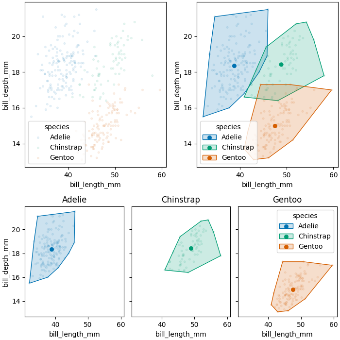

# Escodrinyar: extending seaborn for complex data visualization

Escodrinyar (*Catalan word, derived from the Latin "scrutari", meaning "to examine", or "to search carefully"*)
is a data visualization tool that extends the `seaborn.objects` library by:
- providing a new set of Marks and Stats
- facilitating the creation of complex subfigures

TODO: add more information here

## Example

```python
import escodrinyar as sc
import seaborn.objects as so
import seaborn as sns

penguins = sns.load_dataset("penguins")

# Define multiple plots
points = (
    sc.Plot(data=penguins, x='bill_length_mm', y='bill_depth_mm', color='species')
    .add(so.Dot(marker='.', alpha=0.1))
)

centroids = (
    sc.Plot(data=penguins, x='bill_length_mm', y='bill_depth_mm', color='species')
    .add(so.Dot(alpha=1e-8))  # keep axis limits
    .add(so.Dot(), sc.Agg2d())
)

chull = (
    sc.Plot(data=penguins, x='bill_length_mm', y='bill_depth_mm', color='species')
    .add(sc.ConvexHull(edgewidth=1))
)

# Combine plots in a single figure
fig = (
    points + (chull * points * centroids) |
    (chull * points * centroids).facet('species')
).opts(figsize=(7, 7), height_ratios=[1.3, 1])

# Show figure
fig.show()
```


